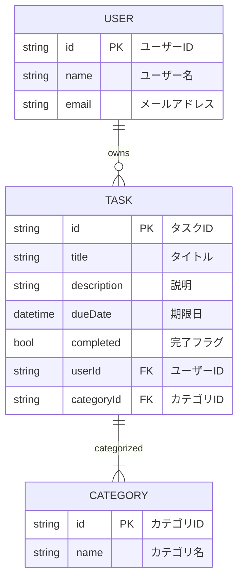
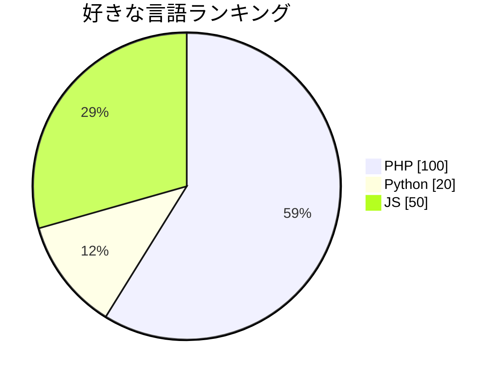
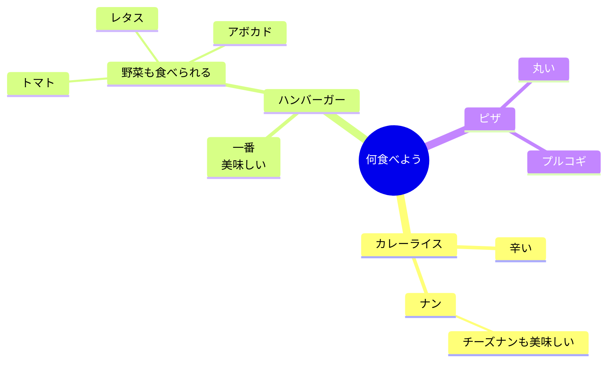

# Mermaidについて
https://mermaid.js.org/intro/

## 具体的になに？
テキストベースの図表を描画する記法

例: クラス図の場合
```text
classDiagram
Class01 <|-- AveryLongClass : Cool
```


## なにがいいの？
- ドキュメントの運用コスト軽減
    - 「ドキュメントが開発に追いつくのを支援」してくれる
- 理解の助けになる
    - ChatGPTに何か聞いたときに、回答がいまいち理解しづらい場合、一旦mermaid記法で図として出力してもらえる
    - PullRequest（or MergeRequest）で用いるとReviewerに優しくなる

## どんな図がかける？
https://mermaid.js.org/syntax/examples.html
- フローチャート
- シーケンス図
- ガントチャート
- クラス図
- Gitgraph (Git) の図
- ER図
- 円グラフ
- マインドマップ
- 4象限（4つのセクション）に分かれた散布図
- XYチャート

## 使い方
- markdownで記述する
    - Git HubやGit Labのmarkdownがかける箇所
    - VSCodeのプレビュー
      - https://marketplace.visualstudio.com/items?itemName=bierner.markdown-mermaid
- webサイトで確認する
    - 公式: https://mermaid.live/ 
- Mermaid JavaScript APIの呼び出し
- scrapboxでも使える
  - https://scrapbox.io/help-jp/Mermaid
```html
<body>
  Here is a mermaid diagram:
  <pre class="mermaid">
        graph TD
        A[Client] --> B[Load Balancer]
        B --> C[Server01]
        B --> D[Server02]
  </pre>

  <script type="module">
    import mermaid from 'https://cdn.jsdelivr.net/npm/mermaid@10/dist/mermaid.esm.min.mjs';
    mermaid.initialize({ startOnLoad: true });
  </script>
</body>
```

## いくつか実際に書いてみる
実際に試してみてください
- https://mermaid.live/ 

### ER図


### 円グラフ



### マインドマップ

